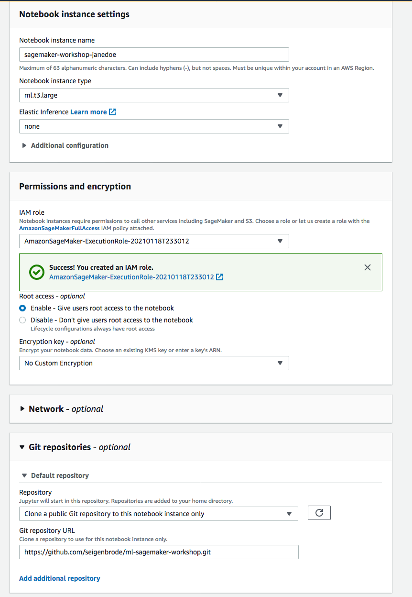
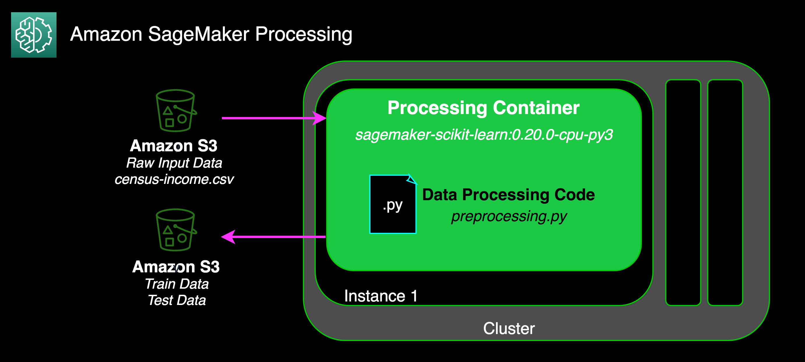
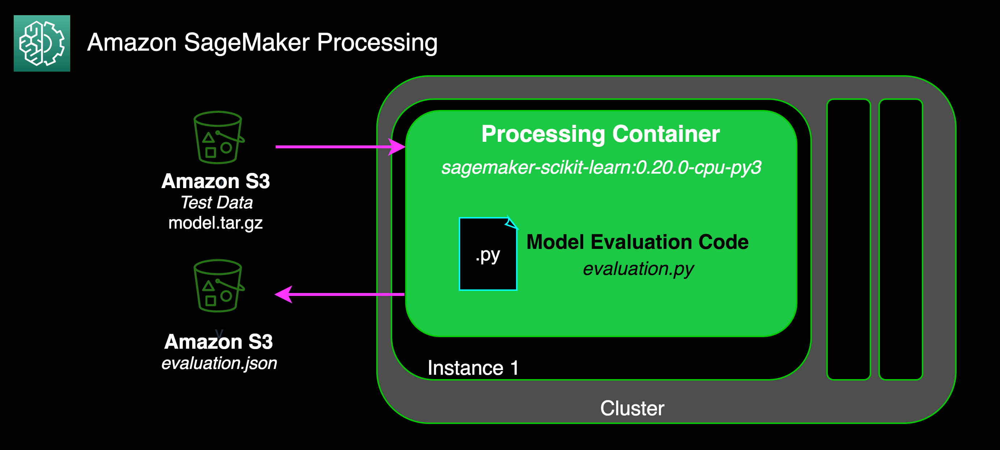

# SageMaker Workshop

  **Description:** This workshop was created to walk users through the end-to-end process and considerations for utilizing SageMaker for Machine Learning.   
  
 The workshop is broken into 4 Labs with an additional step for lab setup: 
 
   * **Lab Setup**
   * **Lab 1:** Data Exploration & Feature Engineering
   * **Lab 2:** Data Processing at Scale using SageMaker Processing
   * **Lab 3:** Build, Train, and Deploy using SageMaker Built-In-Algorithm
   * **Lab 4:** Build, Train, and Deploy using SageMaker Bring-Your-Own-Algorithm
    
 ---
 
 ## **Lab Setup**
    
   ### Login to your AWS Account 
   
   1) Click on the Event Engine URL that is provided by your moderators     
   2) Click on **AWS Console** followed by **Open AWS Console** to login to your lab account
   3) Once logged in, ensure that you are on the US East (N.Virginia) us-east-1 region. You can verify this by checking the upper right hand corner showing the regions.
   
   ### Create SageMaker Notebook Instance 
   
   1) Go to [Amazon SageMaker Service](https://console.aws.amazon.com/sagemaker/)
   2) Ensure you are in *us-east-1/N.Virginia*
   3) Select **Notebook instances** from the left menu
   4) Select **Create notebook instance** in the upper right corner
   5) Under *Notebook Instance Settings*, complete/update the following:
       * **Notebook instance name:** Enter a name for the notebook instance (Ex: sagemaker-workshop-janedoe)
       * **Notebook instance type:** ml.t3.large
       * Toggle **Additional configuration**, enter 15 for **Volume Size in GB**
   6) Under *Permissions and encryption*, complete/update the following:
       * **IAM Role:** Create a new role --> Select 'any S3 bucket' --> Create Role
   7) Under *Git Repositories*:
       * select 'Clone a public git repository to this notebook instance only' from the dropdown
       * Enter 'https://github.com/seigenbrode/ml-sagemaker-workshop.git' under *Git Repository URL*
       
   8) Leave all other sections using default settings, then click **Create notebook instance**
   9) It will take a few moments for the **Status** to change to **InService**
   10) Once the notebook is showing **InService**, click the **Open Jupyter** link to open your hosted notebook instance
   
 ---
 
 For today's labs we will be working inside Jupyter Notebooks.  If you are unfamiliar with Jupyter, below are a few quickstart resources you can review or reach out to your moderator for assistance: 
 
   * [Jupyter Notebook Cheatsheet](https://www.edureka.co/blog/cheatsheets/jupyter-notebook-cheat-sheet)
    
   * [Basics of Jupyter Notebooks](https://towardsdatascience.com/a-beginners-tutorial-to-jupyter-notebooks-1b2f8705888a)
 
 ## Lab 1: Data Exploration & Feature Engineering  

 In this lab, we will be using a modified version of the SageMaker Example Notebook for a direct marketing use case  where we want to target customers that are most likely to enroll in a term deposit after one or more phone calls.  

 **Learning Objective:** The goal of this lab is to apply common techniques in:

   * exploring & understanding your data
   * identifying & transforming features that are most predictive to our machine learning problem
   * evaluating the performance of a model
 
 **Lab Steps:** From within the notebook instance we created in Lab Setup above:
 
   1) Go to the **Files** tab
   2) Click **ml-sagemaker-workshop/lab1**
   3) Click **xgboost_direct_marketing_sagemaker.ipynb** to open Lab 1
   4) The remaining steps for this lab are performed within the notebook instance
   
   
---
 
 ## Lab 2: Data Processing at Scale using SageMaker Processing
   
 In these labs, we will be using modified versions of SageMaker Example Notebooks focused on SageMaker Processing to transform data and evaluate our models. The ML use cases for both labs is predicting whether a census responders has an income greater or less than $50,000.  This is a two part lab to showcase using Amazon SageMaker Processing in two different scenarios. 
 
 In the first scenario (Part 1), we will use the SageMaker built-in support for sklearn to preprocess our data for training and evaluate our model against a hold out dataset. This lab will also show how to use ScriptProcessor to run any custom script in a processing container.  

 
 

 
 
 
 In the second scenario (Part 2), we will explore a custom DASK container that allows us to perform distributed processing on more than one Processing Instance. 

 **Learning Objective:** The goal of this lab is to learn a scalable option for data pre-processing.
 
 **Lab Steps:**

 For Part 1:  We will utilize SageMaker Processing for data pre-processing using the SKLearnProcessor as well as for perform model evalution after training our model.  
 
   1) Go to the **Files** tab
   2) Click **ml-sagemaker-workshop/lab2**
   3) Click **Part1-SageMakerProcessing.ipynb** to open Part 1 of Lab 2
   4) The remaining steps for this lab are performed within the notebook instance

For Part 2: We will also create our own custom processor using ScriptProcessor to demonstrate the ability to bring your own container as well

   1) Go to the **Files** tab
   2) Click **ml-sagemaker-workshop/lab2**
   3) Click **Part2-SageMakerProcessing-DASK.ipynb** to open Part 2 of Lab 2
   4) The remaining steps for this lab are performed within the notebook instance
   
---
 
 ## Lab 3: Build, Train, and Deploy using SageMaker Built-In-Algorithm
   
 In this lab, we will use a SageMaker Built-In Algorithm (XGBoost) to build, train and deploy a model using SageMaker. The ML use case for this scenario is predicting whether a customer will churn (binary classification). This lab includes data exploration, feature engineering, model training, compiling a model as an option prior to deploying a model to a hosted endpoint, and finally evaluating the performance of that model.
 
 **Learning Objective:** Learn available SageMaker options for training and hosting models as well as get additional practice in data pre-processing and feature engineering. 
 
 **Lab Steps:** From within the notebook instance we created in Lab Setup above:
 
   1) Go to the **Files** tab
   2) Click **ml-sagemaker-workshop/lab3**
   3) Click **xgboost_customer_churn.ipynb** to open Lab 3
   4) The remaining steps for this lab are performed within the notebook instance

---
 
 ## Lab 4: Build, Train, and Deploy using SageMaker Bring-Your-Own-Algorithm
   
 In this lab, we will use build,train,and deploy a model using the Bring-You-Own scenario with SageMaker which includes building a customer owned/managed container image that is compatible with SageMaker for training and hosting.   The ML use case for this lab is predicting an Iris species based on sepal/petal measurements.  For this we will use scikit-learn's decision tree algorithm. 

 **Learning Objective:** Learn how to build and use SageMaker compatible container images for building, training, and hosting your ML models. 
 
 **Lab Steps:** From within the notebook instance we created in Lab Setup above:
 
   1) Go to the **Files** tab
   2) Click **ml-sagemaker-workshop/lab4**
   3) Click **Lab4-btd-bring-your-own-algorithm.ipynb** to open Lab 4
   4) The remaining steps for this lab are performed within the notebook instance  
